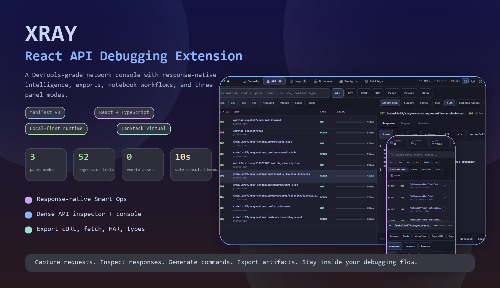
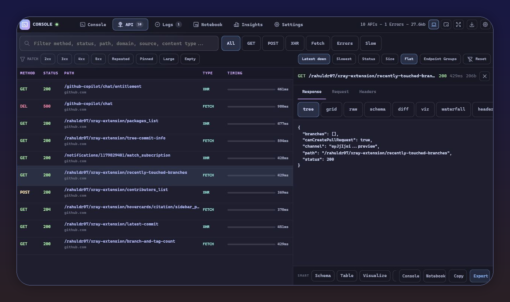
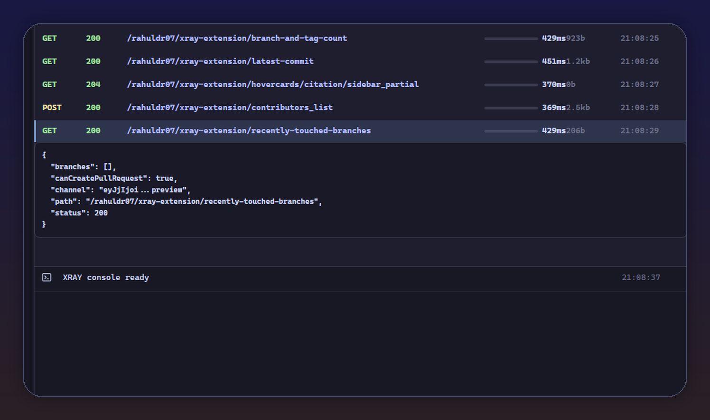
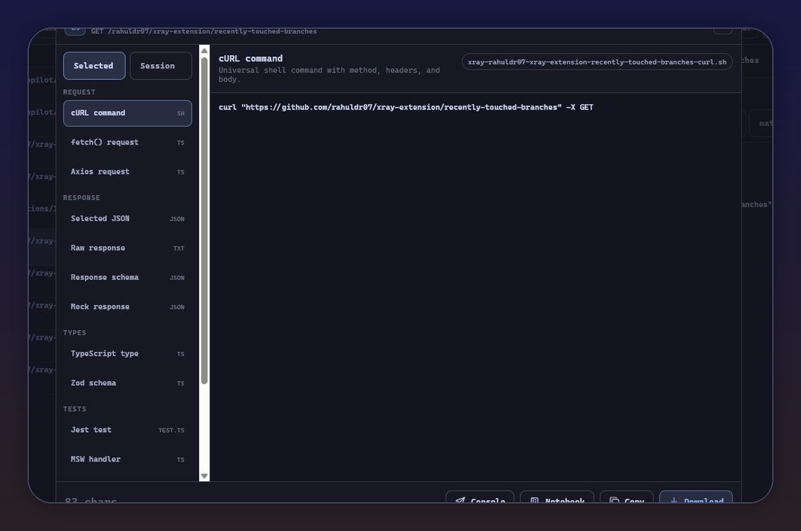
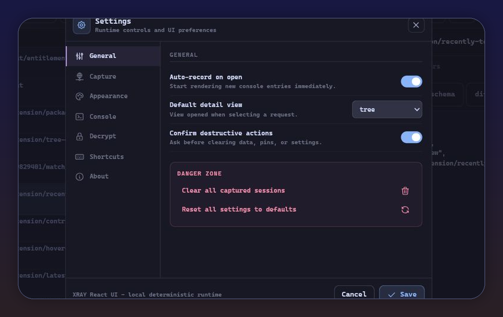
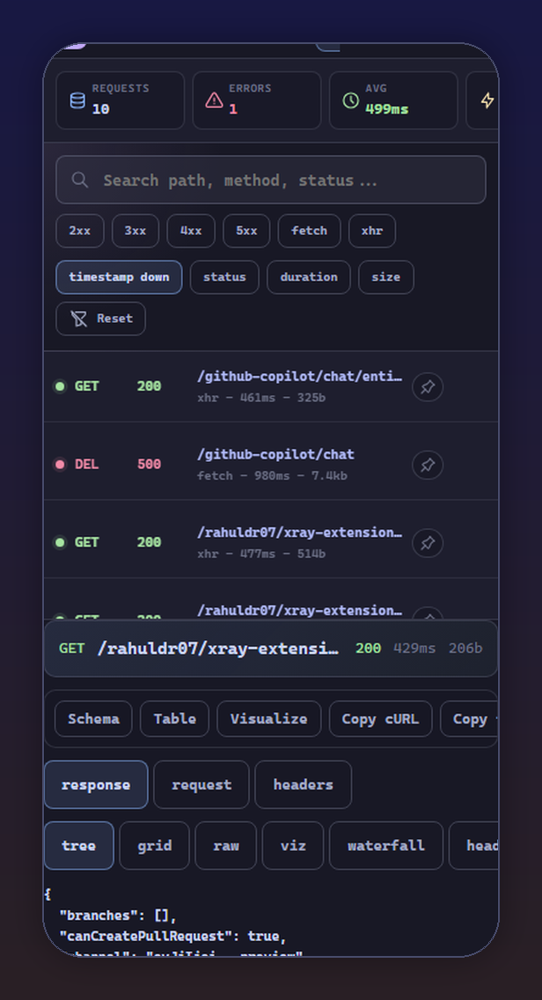
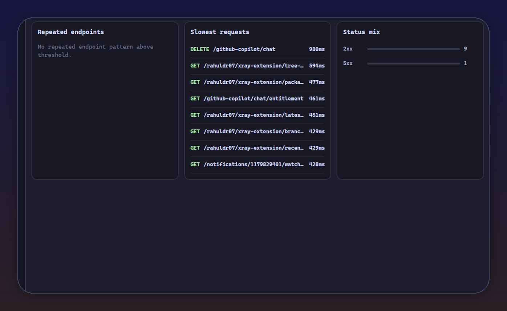

<p align="center">
  
</p>

<h1 align="center">XRAY</h1>

<p align="center">
  <strong>A React-powered API debugging extension for people who live in network traces, JSON responses, console commands, and export workflows.</strong>
</p>

<p align="center">
  <a href="https://github.com/rahuldr07/xray-extension">
    
  </a>
  <a href="https://react.dev/">
    
  </a>
  <a href="https://tanstack.com/virtual/latest">
    
  </a>
  
</p>

<p align="center">
  <a href="#screenshots">Screenshots</a>
  <span> . </span>
  <a href="#why-xray">Why XRAY</a>
  <span> . </span>
  <a href="#smart-response-operations">Smart Ops</a>
  <span> . </span>
  <a href="#architecture">Architecture</a>
  <span> . </span>
  <a href="#install">Install</a>
</p>

---

## What It Is

XRAY is a browser extension that turns captured API calls into an interactive debugging workspace. It keeps the page-facing runtime vanilla JavaScript for extension safety, then renders the user experience with a bundled React + TypeScript panel.

It is built for one workflow:

```txt
capture request -> inspect response -> run safe commands -> compare data -> export artifacts
```

No separate AI chat. No noisy copilot feed. Intelligence appears where it matters: directly beside the selected response.

## Screenshots

### Network Inspector Pro

Dense request table, selected-row highlight, response drawer, quick filters, endpoint grouping, status flags, timing, size, and contextual operations.

<p align="center">
  
</p>

### DevTools-Style Console

The Console tab stays familiar: network stream on top, inline output below, command prompt pinned at the bottom, and request-aware helpers available in context.

<p align="center">
  
</p>

### Export Modal

Export selected requests or whole sessions as debugging artifacts: cURL, fetch, axios, JSON, schema, mock data, TypeScript, Zod, Jest, MSW, CSV, and HAR.

<p align="center">
  
</p>

### Settings And Mobile Detail

Settings are real controls, not placeholders. Mobile keeps the response detail usable with a compact bottom-sheet style layout.

<table>
  <tr>
    <td width="66%">
      
    </td>
    <td width="34%">
      
    </td>
  </tr>
</table>

### Local Insights

XRAY surfaces deterministic session signals from captured requests: error counts, slowest requests, repeated endpoints, status mix, average latency, and payload size.

<p align="center">
  
</p>

## Why XRAY

Most API inspectors show the response and stop. XRAY is built around what you do next.

| Need | XRAY answer |
| --- | --- |
| "What happened?" | Dense request table, console stream, status flags, timing, size, and logs. |
| "What is inside this response?" | Tree, raw, grid, schema, visualize, diff, waterfall, and headers views. |
| "What should I try next?" | Contextual Smart Ops directly on the selected response. |
| "Can I turn this into code?" | cURL, fetch, axios, TypeScript, Zod, Jest, MSW, mocks, HAR, CSV. |
| "Can I debug without leaving the page?" | Floating HUD with drag, resize, collapse, and focus isolation. |
| "Can I use a larger workspace?" | DevTools panel and pop-out window modes. |

## Core Features

| Area | What is included |
| --- | --- |
| Capture | `fetch`, XHR, console logs, warnings, errors, tables, and page output. |
| API Inspector | Virtualized request table, endpoint groups, quick filters, selected detail drawer. |
| Console | DevTools-style stream, command history, request-aware aliases, safe output rendering. |
| Notebook | Saved investigation cells that can run against the selected response context. |
| Smart Ops | Schema, Table, Visualize, Compare Previous, Diff, Similar Calls, Related Errors. |
| Export | Request and session exports for shell, JavaScript, types, tests, mocks, CSV, and HAR. |
| Settings | Capture toggles, thresholds, row density, default view, accent, confirmations. |
| Modes | Floating HUD, DevTools panel, pop-out window. |
| Safety | Bounded serialization, text-rendered data, source validation, no remote UI assets. |

## Smart Response Operations

XRAY does not guess globally. It reacts to the selected response.

| Response shape | Operations XRAY can surface |
| --- | --- |
| JSON object or array | Schema, Table, Visualize, Send to Console, Send to Notebook. |
| 4xx or 5xx status | Inspect Error, Related Errors, Compare Previous. |
| Slow request | Similar Calls, Waterfall, Slow Calls. |
| Repeated endpoint | Similar Calls, Endpoint Groups, Waterfall. |
| Large payload | Schema, Table, Copy Full. |
| Empty response | Headers, Request, Similar Calls. |
| Schema drift | Compare Previous, Diff, Schema. |

Operations either switch a view, copy generated text, open Export, or insert a prepared command. They never auto-run code.

## Console Helpers

When a request is selected, XRAY prepares useful aliases:

```js
res
req
headers
entry
prev()
next()
similar()
errors()
slow(500)
status(500)
endpoint('/api/users')
domain('api.example.com')
schema(res)
table(res.items || res)
diff(prev()?.responseDecrypted, res)
mock(entry)
```

Example investigation flow:

```js
schema(res)
table(res.items || res)
diff(prev()?.responseDecrypted, res)
errors()
slow(1000)
```

## Three Ways To Use It

| Mode | Open with | Best for |
| --- | --- | --- |
| Floating HUD | Extension icon or `Ctrl+Shift+X` | Fast debugging without leaving the page. |
| DevTools panel | Browser DevTools -> XRAY | Long debugging sessions beside Elements, Network, and Console. |
| Pop-out window | Window button inside XRAY | Wide inspection, exports, and comparing response details. |

## Architecture

XRAY has a strict boundary: UI is React, capture/runtime stays vanilla.

```txt
Page MAIN world
  content/interceptor.js
  content/console-capture.js
  content/console-executor.js
  content/decrypt-bridge.js
        |
        v
Isolated extension world
  content/content.js
  content/hud-mount.js
  shared/store.js
  shared/console-helpers.js
  shared/worker-client.js
        |
        v
React panel UI
  src/panel/main.tsx       -> dist/panel-ui.js
  src/panel/hud-main.tsx   -> dist/hud-ui.js
  src/panel/window-main.tsx -> dist/window-ui.js
        |
        v
Surfaces
  Floating HUD
  DevTools panel
  Pop-out window
```

## Tech Stack

| Layer | Choice |
| --- | --- |
| Extension | Manifest V3 |
| UI | React + TypeScript |
| Build | Vite IIFE bundles |
| State | Zustand |
| Virtualization | `@tanstack/react-virtual` |
| Icons | `@tabler/icons-react` |
| Styling | Catppuccin Mocha tokens scoped with Shadow DOM `:host` |
| Runtime | Vanilla JavaScript content scripts and service worker |

The extension UI does not load web fonts, CDN scripts, or remote UI assets.

## Install

```bash
git clone https://github.com/rahuldr07/xray-extension.git
cd xray-extension
npm install
npm run build
```

Load it in Chrome or Edge:

1. Open `chrome://extensions` or `edge://extensions`.
2. Enable Developer mode.
3. Click Load unpacked.
4. Select the `xray-extension` folder.
5. After rebuilding, reload the extension from the browser extensions page.

## Development

```bash
npm run dev        # Vite dev server for preview pages
npm run build      # Build dist/panel-ui.js, dist/hud-ui.js, dist/window-ui.js
npm run typecheck  # TypeScript check
npm test           # Regression tests
npm run check      # typecheck + build + tests
```

Preview routes:

```txt
http://127.0.0.1:8765/preview/ui-preview.html?tab=console
http://127.0.0.1:8765/preview/ui-preview.html?tab=api
```

## Project Map

```txt
xray-extension/
  background.js                 # service worker, toggles, debugger eval, DevTools relay
  manifest.json                 # MV3 scripts, permissions, web accessible bundles
  window.html                   # pop-out window host
  content/
    interceptor.js              # MAIN world fetch/XHR capture
    console-capture.js          # MAIN world console capture
    console-executor.js         # MAIN world command execution bridge
    decrypt-bridge.js           # MAIN world decrypt relay
    content.js                  # isolated relay into XRAY_Panel
    hud-mount.js                # closed-shadow floating HUD host
  src/panel/
    App.tsx                     # shared React app
    main.tsx                    # panel bundle entry
    hud-main.tsx                # HUD bundle entry
    window-main.tsx             # pop-out bundle entry
    store.ts                    # Zustand state
    components/                 # Console, API, Detail, Export, Settings, Notebook, Insights
    models/                     # typed pure logic for entries, export, ops, settings
    runtime/                    # bridges to vanilla console/storage/capture config
    styles/                     # tokens and HUD styles
  shared/
    console-helpers.js          # request-aware helper primitives
    decrypt.js                  # pluggable decrypt function
    store.js                    # storage wrapper
    worker-client.js            # worker client with fallback
  preview/
    ui-preview.html             # local React preview harness
  test/
    security-regressions.test.js
```

## Verification

Current baseline:

```txt
npm run check
typecheck: passed
build: passed
tests: 52 passed
```

Extra syntax sweep used for retained vanilla JavaScript:

```powershell
$files = rg --files -g "*.js" -g "!node_modules/**"
foreach ($file in $files) {
  node --check $file
  if ($LASTEXITCODE -ne 0) { exit $LASTEXITCODE }
}
```

## Design System

XRAY uses a fixed Catppuccin Mocha token set inside the panel Shadow DOM:

```css
:host {
  --xray-bg: #1e1e2e;
  --xray-surface: #181825;
  --xray-surface2: #313244;
  --xray-text: #cdd6f4;
  --xray-green: #a6e3a1;
  --xray-blue: #89b4fa;
  --xray-yellow: #f9e2af;
  --xray-red: #f38ba8;
  --xray-mauve: #cba6f7;
  --xray-teal: #94e2d5;
  --xray-peach: #fab387;
  --xray-hint: #6c7086;
  --xray-subtext: #a6adc8;
  --xray-font: 'JetBrains Mono', 'Fira Code', 'Cascadia Code', monospace;
}
```

No web font import is required. Users with JetBrains Mono get it; everyone else falls through the local stack.

## License

This repository currently uses the `ISC` license field in `package.json`.
