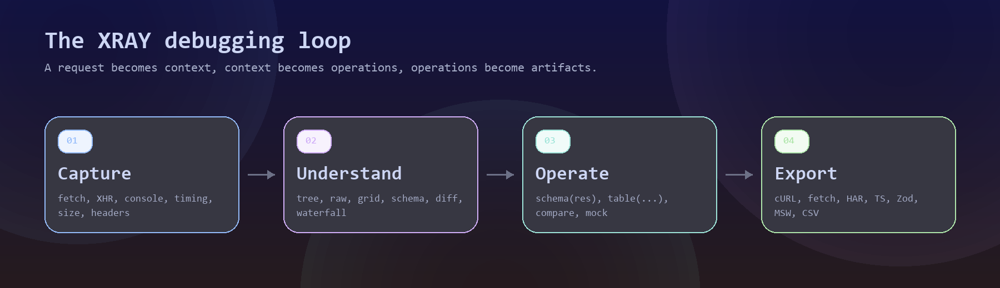
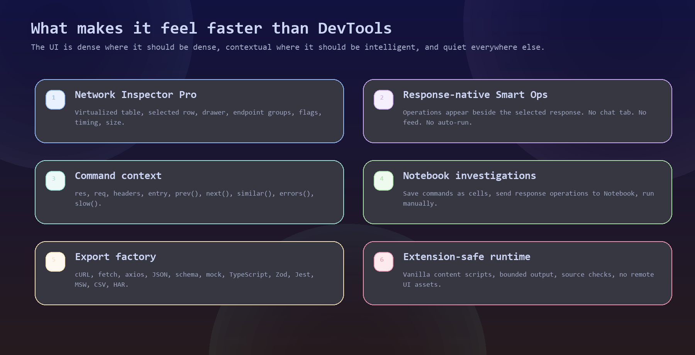
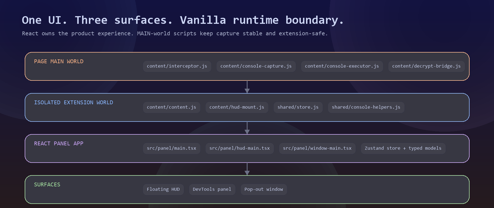

<p align="center">
  
</p>

<h1 align="center">XRAY</h1>

<p align="center">
  <strong>Not another JSON viewer. XRAY is a response operations console for API debugging.</strong>
</p>

<p align="center">
  It captures requests, understands responses, prepares context-aware operations, and turns live traffic into commands, notebook cells, exports, schemas, mocks, and test assets.
</p>

<p align="center">
  <a href="https://github.com/rahuldr07/xray-extension">
    
  </a>
  <a href="https://react.dev/">
    
  </a>
  <a href="https://tanstack.com/virtual/latest">
    
  </a>
  
  
</p>

<p align="center">
  <a href="#the-debugging-loop">Debugging Loop</a>
  <span> . </span>
  <a href="#product-tour">Product Tour</a>
  <span> . </span>
  <a href="#smart-response-operations">Smart Ops</a>
  <span> . </span>
  <a href="#architecture">Architecture</a>
  <span> . </span>
  <a href="#install">Install</a>
</p>

---

## The Pitch

Chrome DevTools is powerful, but API investigation still becomes a tab-switching routine: Network panel, Console, copied JSON, external formatter, copied cURL, handmade mocks, notes somewhere else.

XRAY compresses that workflow into one extension surface.

<table>
  <tr>
    <td width="25%"><strong>Capture</strong><br><sub>fetch, XHR, console logs, timing, size, headers.</sub></td>
    <td width="25%"><strong>Inspect</strong><br><sub>tree, raw, grid, schema, diff, waterfall, headers.</sub></td>
    <td width="25%"><strong>Operate</strong><br><sub>contextual commands and response-native actions.</sub></td>
    <td width="25%"><strong>Export</strong><br><sub>cURL, fetch, axios, JSON, HAR, types, tests.</sub></td>
  </tr>
</table>

## The Debugging Loop

<p align="center">
  
</p>

XRAY is designed around the moment after you click a request and ask: what can I do with this response right now?

It answers with response-native operations. They switch views, copy generated artifacts, open the export modal, or insert prepared commands into Console or Notebook. They do not auto-run code.

## Product Tour

### 1. Network Inspector Pro

A dense API inspector that keeps the table wide, the selected request obvious, and the response detail close.

<p align="center">
  
</p>

What is built in:

| Capability | Detail |
| --- | --- |
| Wide request table | Method, status, path, domain, type, timing, size, time, flags. |
| One selected row | Strong highlight and one active detail drawer at a time. |
| Smart flags | Error, Slow, Repeated, Large, Empty, Pinned. |
| Endpoint grouping | Count, errors, average/max timing, total size, last seen. |
| Fast lists | TanStack Virtual for long request and console streams. |
| Detail views | Tree, raw, grid, schema, diff, visualize, waterfall, headers. |

### 2. Console That Feels Familiar

The Console tab starts with DevTools fundamentals: compact filters, request stream, inline output, and a pinned prompt.

<p align="center">
  
</p>

The selected request becomes command context:

```js
res
req
headers
entry
prev()
next()
similar()
errors()
slow(1000)
schema(res)
table(res.items || res)
diff(prev()?.responseDecrypted, res)
```

### 3. Export Everything Useful

The export modal is built for turning debugging state into real artifacts.

<p align="center">
  
</p>

| Request exports | Session exports |
| --- | --- |
| JSON, raw response, cURL, fetch, axios | Session JSON |
| Schema, mock response, TypeScript, Zod | Session CSV |
| Jest test, MSW handler | Session HAR |

Formats that need a selected request are disabled with an explanation rather than behaving like dead controls.

### 4. Settings, Mobile, Insights

<table>
  <tr>
    <td width="66%">
      
    </td>
    <td width="34%">
      
    </td>
  </tr>
</table>

<p align="center">
  
</p>

Settings are wired to state and runtime behavior where appropriate:

- Capture fetch and XHR toggles.
- Recording mode.
- Max entries.
- Slow and very-slow thresholds.
- Default detail view.
- Compact rows.
- Show host in path.
- Accent color.
- Destructive-action confirmations.

## What Makes It Different

<p align="center">
  
</p>

| Ordinary inspector | XRAY |
| --- | --- |
| Shows requests | Turns selected requests into executable context. |
| Shows JSON | Adds tree, raw, grid, schema, diff, visualize, waterfall. |
| Copies cURL | Exports cURL, fetch, axios, types, schemas, mocks, tests, HAR, CSV. |
| Global assistant feed | Response-native operations beside the current response. |
| One panel mode | Floating HUD, DevTools panel, and pop-out window. |
| String rendering risk | Text-rendered output, bounded serialization, no unsafe HTML. |

## Smart Response Operations

XRAY does not need a separate Copilot tab to feel intelligent. The selected response gets the operations it deserves.

| Situation | Operations XRAY can surface |
| --- | --- |
| JSON object or array | Schema, Table, Visualize, Send to Console, Send to Notebook. |
| 4xx or 5xx response | Inspect Error, Related Errors, Compare Previous. |
| Slow request | Similar Calls, Waterfall, Slow Calls. |
| Repeated endpoint | Similar Calls, Endpoint Groups, Waterfall. |
| Large payload | Schema, Table, Copy Full. |
| Empty response | Headers, Request, Similar Calls. |
| Schema drift | Compare Previous, Diff, Schema. |

Operations stay user-controlled:

```txt
view operation      -> switch response view
copy operation      -> copy generated text
console operation   -> insert command, do not run
notebook operation  -> create a cell, do not run
export operation    -> open export modal
```

## Three Surfaces

| Surface | Open with | Use it for |
| --- | --- | --- |
| Floating HUD | Extension icon or `Ctrl+Shift+X` | Fast debugging without leaving the page. |
| DevTools panel | Browser DevTools -> XRAY | Long investigation beside Elements, Network, and Console. |
| Pop-out window | Window button inside XRAY | Wide response inspection and export workflows. |

The HUD is draggable, resizable, collapsible, and mounted in a closed Shadow DOM host.

## Architecture

<p align="center">
  
</p>

The important boundary:

```txt
React owns UI.
Vanilla scripts own extension runtime.
```

Why this matters:

- MAIN-world interception remains simple and compatible.
- React never needs to run inside page interception code.
- UI can be redesigned without rewriting capture.
- Console execution remains behind the existing hardened bridge.
- The same React app can mount into HUD, DevTools, and pop-out surfaces.

## Tech Stack

| Layer | Choice |
| --- | --- |
| Extension | Manifest V3 |
| UI | React + TypeScript |
| Build | Vite IIFE bundles |
| State | Zustand |
| Virtualization | `@tanstack/react-virtual` |
| Icons | `@tabler/icons-react` |
| Styling | Catppuccin Mocha tokens scoped with Shadow DOM `:host` |
| Runtime | Vanilla JavaScript content scripts and service worker |

The extension UI does not load web fonts, CDN scripts, or remote UI assets.

## Install

```bash
git clone https://github.com/rahuldr07/xray-extension.git
cd xray-extension
npm install
npm run build
```

Load it in Chrome or Edge:

1. Open `chrome://extensions` or `edge://extensions`.
2. Enable Developer mode.
3. Click Load unpacked.
4. Select the `xray-extension` folder.
5. After rebuilding, reload the extension from the browser extensions page.

## Development

```bash
npm run dev        # Vite dev server for preview pages
npm run build      # Build dist/panel-ui.js, dist/hud-ui.js, dist/window-ui.js
npm run typecheck  # TypeScript check
npm test           # Regression tests
npm run check      # typecheck + build + tests
```

Preview routes:

```txt
http://127.0.0.1:8765/preview/ui-preview.html?tab=console
http://127.0.0.1:8765/preview/ui-preview.html?tab=api
```

## Project Map

```txt
xray-extension/
  background.js                 # service worker, toggles, debugger eval, DevTools relay
  manifest.json                 # MV3 scripts, permissions, web accessible bundles
  window.html                   # pop-out window host
  content/
    interceptor.js              # MAIN world fetch/XHR capture
    console-capture.js          # MAIN world console capture
    console-executor.js         # MAIN world command execution bridge
    decrypt-bridge.js           # MAIN world decrypt relay
    content.js                  # isolated relay into XRAY_Panel
    hud-mount.js                # closed-shadow floating HUD host
  src/panel/
    App.tsx                     # shared React app
    main.tsx                    # panel bundle entry
    hud-main.tsx                # HUD bundle entry
    window-main.tsx             # pop-out bundle entry
    store.ts                    # Zustand state
    components/                 # Console, API, Detail, Export, Settings, Notebook, Insights
    models/                     # typed pure logic for entries, export, ops, settings
    runtime/                    # bridges to vanilla console/storage/capture config
    styles/                     # tokens and HUD styles
  shared/
    console-helpers.js          # request-aware helper primitives
    decrypt.js                  # pluggable decrypt function
    store.js                    # storage wrapper
    worker-client.js            # worker client with fallback
  preview/
    ui-preview.html             # local React preview harness
  test/
    security-regressions.test.js
```

## Verification

Current baseline:

```txt
npm run check
typecheck: passed
build: passed
tests: 52 passed
```

Extra syntax sweep used for retained vanilla JavaScript:

```powershell
$files = rg --files -g "*.js" -g "!node_modules/**"
foreach ($file in $files) {
  node --check $file
  if ($LASTEXITCODE -ne 0) { exit $LASTEXITCODE }
}
```

## Security Notes

- Message consumers validate page message source where needed.
- Command execution is session-scoped and result-bounded.
- Captured strings render as text, not HTML.
- Large and circular values serialize safely.
- No Google Fonts, CDN scripts, or remote UI assets.
- Shadow DOM tokens are defined with `:host`, not `:root`.

## Design Tokens

```css
:host {
  --xray-bg: #1e1e2e;
  --xray-surface: #181825;
  --xray-surface2: #313244;
  --xray-text: #cdd6f4;
  --xray-green: #a6e3a1;
  --xray-blue: #89b4fa;
  --xray-yellow: #f9e2af;
  --xray-red: #f38ba8;
  --xray-mauve: #cba6f7;
  --xray-teal: #94e2d5;
  --xray-peach: #fab387;
  --xray-hint: #6c7086;
  --xray-subtext: #a6adc8;
  --xray-font: 'JetBrains Mono', 'Fira Code', 'Cascadia Code', monospace;
}
```

## License

This repository currently uses the `ISC` license field in `package.json`.
